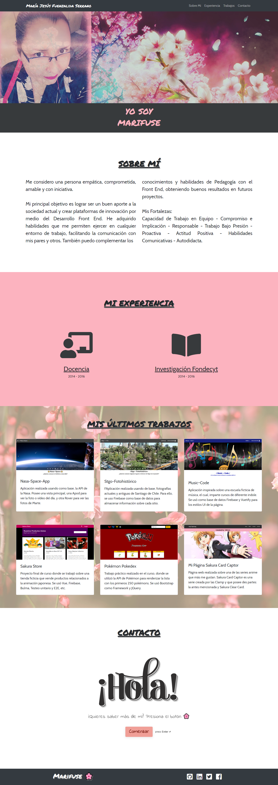

# Mi Portafolio

## Perfil

En este portafolio propongo mis conocimientos que poseo en **HTML, CSS, JS**, pasando por **Bootstrap, Sass**, trabajos con **Api's**, uso de **MongoDB**, llegando posteriormente a **Vue, frameworks UI, Firebase**, etc.

Para ver mis proyectos, pueden visitar mi GitHub en el siguiente link: https://github.com/Marifuse

_Palabras Clave: Front End, HTML, CSS, JavaScript, Sass, MongoDB, API, Framework, UI, Vue, Firebase._

___

In this portfolio I propose my knowledge that I have in **HTML, CSS, JS**, going through **Bootstrap, Sass**, working with **Api's**, using **MongoDB**, later reaching **Vue, UI frameworks, Firebase**, etc.

To see my projects, you can visit my GitHub at the following link: https://github.com/Marifuse

_Keywords: Front End, HTML, CSS, JavaScript, Sass, MongoDB, API, Framework, UI, Vue, Firebase._

## Page View

### Portfolio Page

## Redes de Contacto

**Correo Electrónico:** _maria.fuenzalida.serrano@gmail.com_

**LinkedIn:** _https://www.linkedin.com/in/marifuse/_

**_María Jesús Fuenzalida S._**

###### August 2020